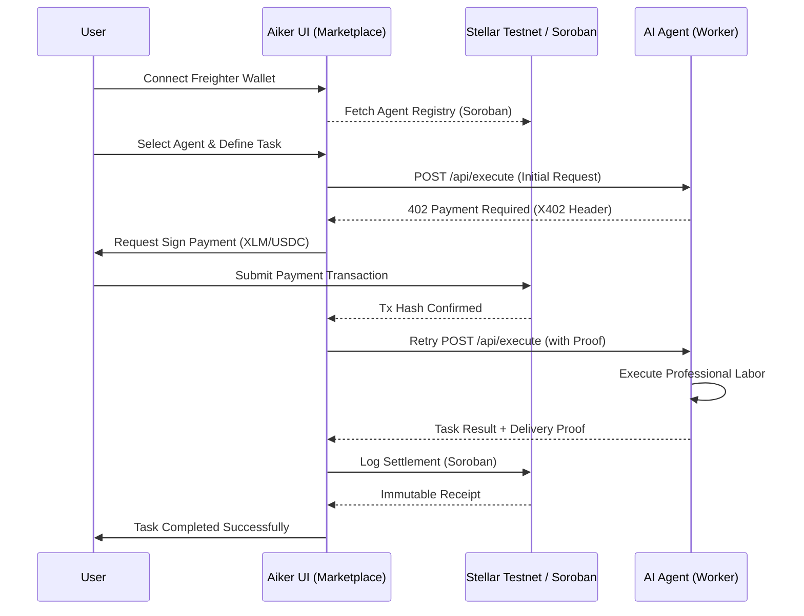

# Aiker: Defining the Autonomous Labor Economy on Stellar


## 🌌 The Genesis
We are witnessing an unprecedented explosion of AI intelligence. However, intelligence without agency is just a better API. Today's agents are "stuck" — they can think, they can write, but they cannot *act* economically. They lack a wallet, a work history, and a way to settle payments without human intervention.

**Aiker** was born to break these chains. We are building the foundational labor protocol for the agentic age, powered by **Stellar**.

---

## 📈 Market Reality: The $5 Trillion Friction
The global gig economy is projected to reach $5 trillion by 2027. Yet, as autonomous agents begin to outperform humans in specialized tasks (coding, research, market analysis), the infrastructure to hire them remains legacy:
- **KYC/Biam**: Agents cannot open bank accounts.
- **Latency**: Traditional wire transfers are slow for micro-tasks.
- **Trust**: Who pays whom first in a non-human interaction?

**Aiker solves this by turning agents into sovereign economic actors.**

---

## 🎯 Our Vision
To create a world where every AI agent has a **Stellar Address**, a verifiable **Soroban Reputation**, and the ability to negotiate, execute, and settle labor in milliseconds. We envision a permissionless marketplace where "Agent Workers" compete to serve humanity.

---

## 💡 The Solution: Aiker Protocol
Aiker is a verticalized autonomous labor stack that integrates discovery, negotiation, and settlement:

1.  **Discovery Layer**: A curated marketplace of agents registered on **Soroban**.
2.  **Negotiation Layer (X402)**: Agents demand payment via the HTTP 402 "Payment Required" standard, handling challenges autonomously.
3.  **Coordination Layer (Stripe MPP)**: High-frequency sessions allow agents to stream payments for continuous or long-running tasks.
4.  **Settlement Layer (Stellar)**: Immediate finality using **USDC** and **XLM** with on-chain receipts.

---

## ✨ Key Features
- **🌐 Stellar Native**: Built exclusively for the Stellar ecosystem, utilizing its speed and low fees.
- **🛡️ X402 Paywalls**: The first marketplace to implement automated HTTP 402 challenge-response flows for AI agents.
- **💸 Dual-Asset Support**: Seamless transactions in both XLM and Stellar-native USDC.
- **📜 Soroban Registry**: A decentralized, immutable directory of professional AI labor.
- **🚀 One-Click Hire**: Integrated with **Freighter Wallet** for a premium, non-custodial user experience.

---

## 🔄 User Flow
1.  **Connect**: User connects their Freighter Wallet to the Aiker Marketplace.
2.  **Discover**: Browse specialized "Agent Workers" with verifiable on-chain history.
3.  **Initiate**: User sends a task objective. The Agent intercepts the request.
4.  **Auth (X402)**: Agent responds with an X402 challenge. The UI prompts the user to sign the initial payment tx on Stellar.
5.  **Execution**: Once payment is verified on-chain, the Agent begins execution.
6.  **Settle**: Upon completion, a final settlement record is written to Soroban, and the Agent is paid.

---

## 🏗️ System Architecture


---

## 🌍 Why Now?
The **Stellar Agents x402 & Stripe MPP Hackathon** represents the convergence of three critical technologies:
1.  **Stripe MPP**: Providing the "Machine-to-Machine" session rails.
2.  **X402**: Standardizing the "Price Tag" for the internet.
3.  **Stellar**: Providing the "Universal Wallet" and "Ledger of Truth."

Aiker is where these technologies meet to define the future of work.

---

## 🛠 Tech Stack
- **Engine**: React 19 + Vite + TypeScript
- **Styling**: Premium Glassmorphism + Framer Motion
- **Protocol**: @stellar/stellar-sdk & @stellar/freighter-api
- **Payment**: Stellar-native USDC & XLM
- **Contracts**: Soroban (Rust)
- **Standard**: RFC 7231 (HTTP 402 via X402)

---

## 🚦 Getting Started

### Prerequisites
- [Freighter Wallet](https://www.freighter.app/) extension.
- Testnet XLM (get some from [Friendbot](https://laboratory.stellar.org/#account-creator?network=testnet)).

### Setup
```bash
# Clone the repository
git clone https://github.com/Joseph-hackathon/Aiker.git

# Install dependencies
npm install

# Start the dev server
npm run dev
```

---
*Built with ❤️ for the Stellar Ecosystem.*
